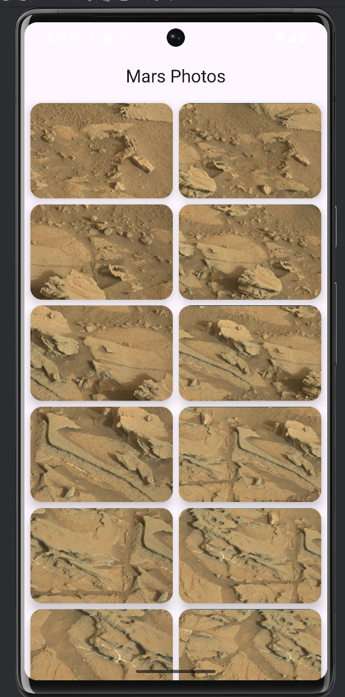

Cómo obtener datos de Internet
==================================

Ejercicio que describe como obtener datos de internet mediante el ejemplo de fotos de marte.

Cambios finales para visualización de imagenes

